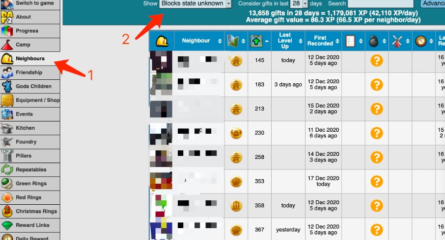
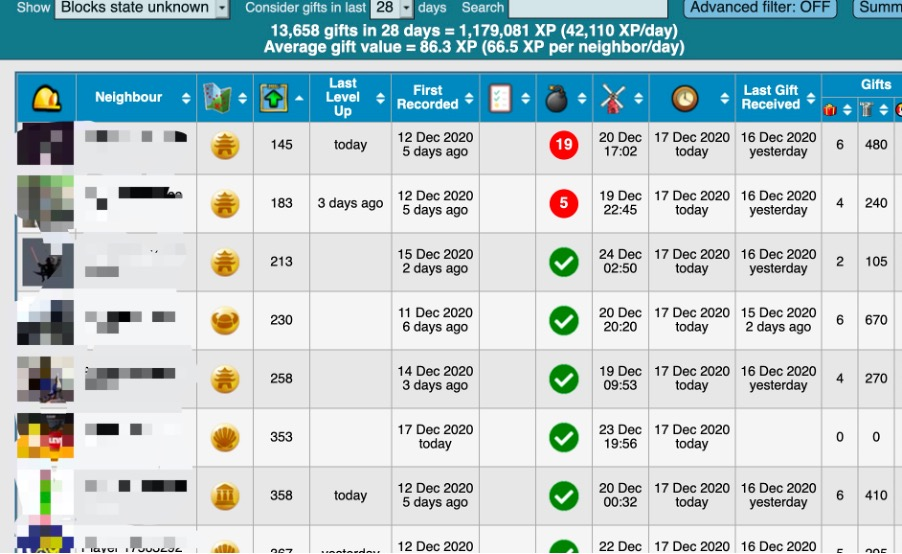
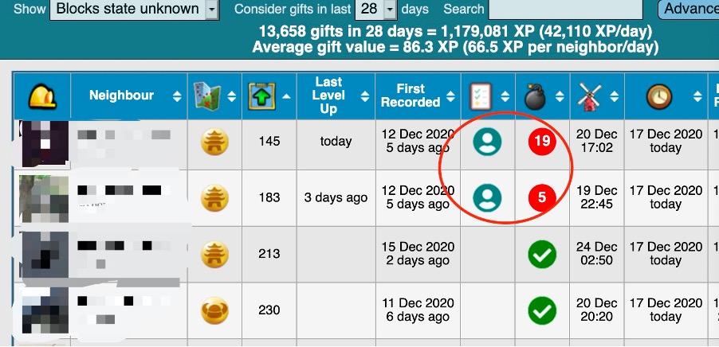

# Manage neighbours
Diggy only provides one custom list called "Best Friends" to label particular game friends (neighbours). This list 
could be used as windmill list, 'stone list' or anything else. The term 'stone list' here means the players who have 
not cleared the camp and need lots of stones for clearing. It would be very helpful to send stones as gifts to those 
neighbours. However to check every neighbour’s camp is a very tiring and tedious job, it would become much more 
manageable with the help of DAF2.  

### Steps
1. Go to Neighbours section, show the Blocks state unknown neighbours. This list contains the neighbours who have 
   not been visited since becoming friends in Facebook and synced into the game.
2. Go through all neighbours’ camp to update the camp and windmill status. After walking through all neighbours, the 
   list will be updated.
3. Add the two neighbours highlighted int the best friend list
4. Switch the show option to ‘With blocks to clear’, note the number at the bottom. Then switch the show option to ‘In custom list’, note the number again. Compare these two numbers
   1. If those two numbers match: job done
   2. If the number of ‘with blocks to clear’ list is greater: some neighbours are missed to be added into the 
      stone list
   3. If the number of ‘in custom list’ list is greater: some neighbours have cleared their camp but not removed from 
         the stone list. Find them and remove.
   4. This could be achieved by using the Advanced filter -> formula (blocks > 0)<>(list=1) More details [here](neighbourFilter.md)

