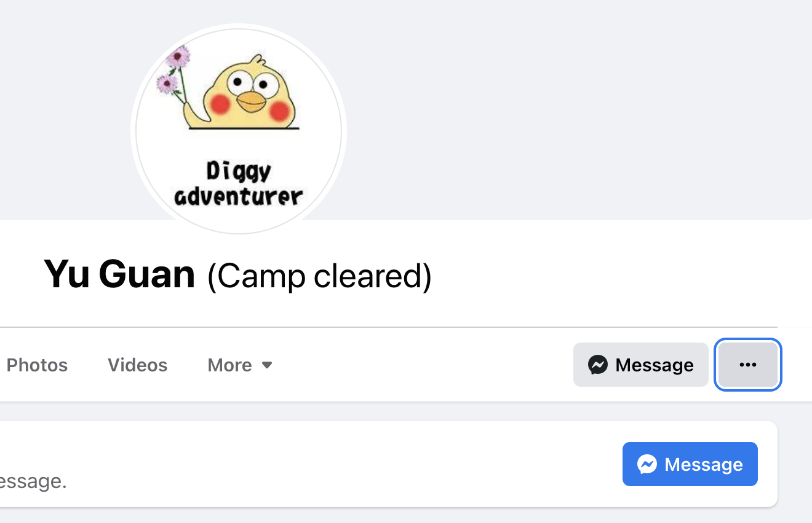
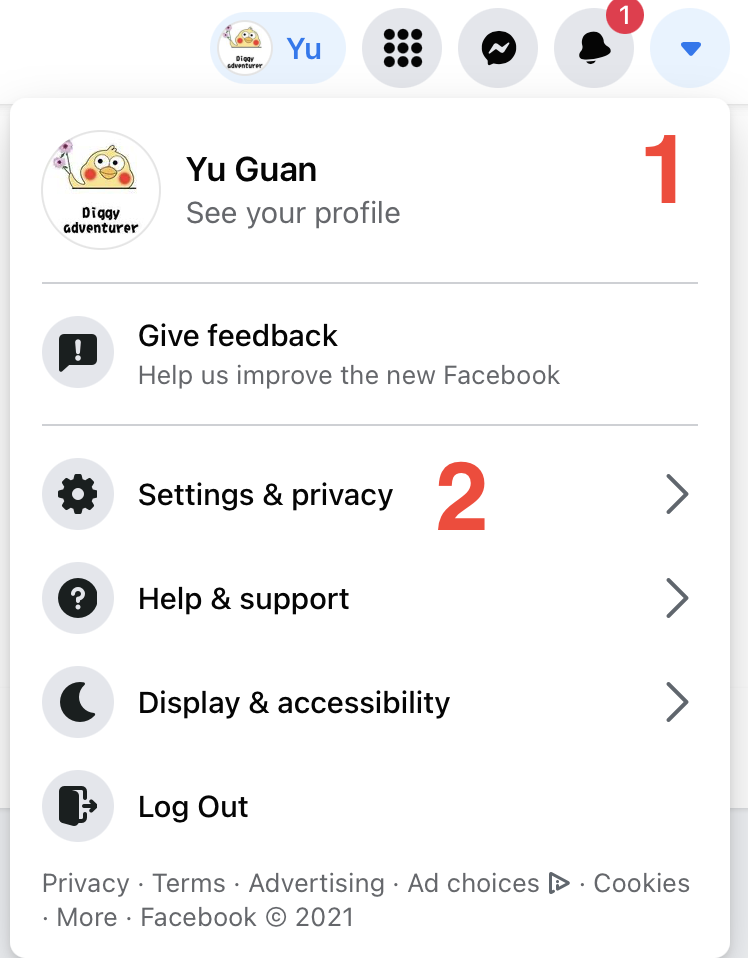
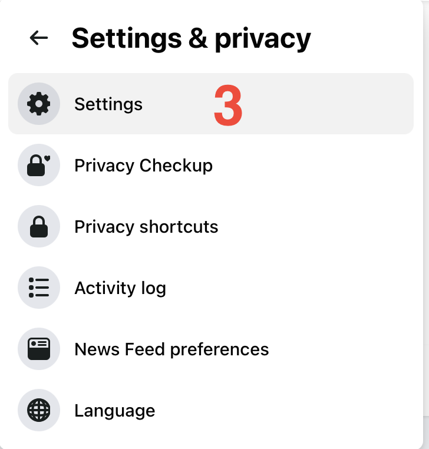
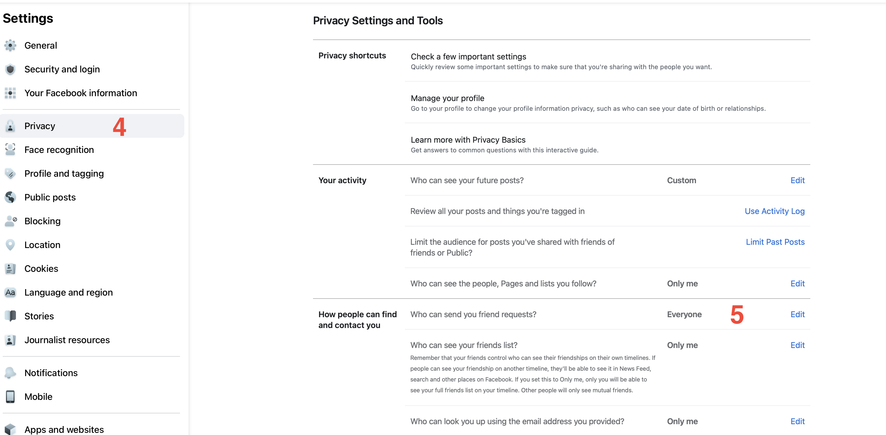
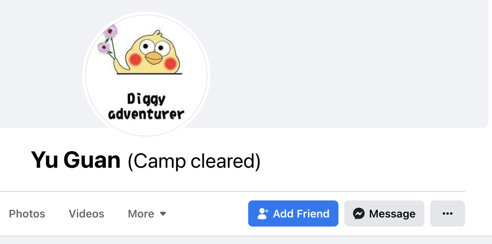

Facebook neighbours could help your diggy progress dramatically. It is crucial to be able to add friends or be added 
as friends. 
If you want to receive friend requests or put yourself onto the add me poll in facebook groups, then please make 
sure that there is ‘Add Friend’ button on your Facebook profile. Below is the example of without 'Add Friend ' button.

Steps to enable 'Add Friend' button:
----
 1. In the top right corner of Facebook, click the triangle
 2. Click Setting & privacy 
 3. Click Settings 
 4. Click Privacy 
 5. Under Privacy Settings and Tools, change the setting of ‘How people can find and contact you’ to ‘Everyone’

After these steps, the profile would like below 