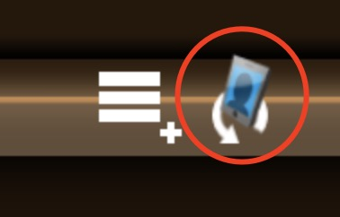
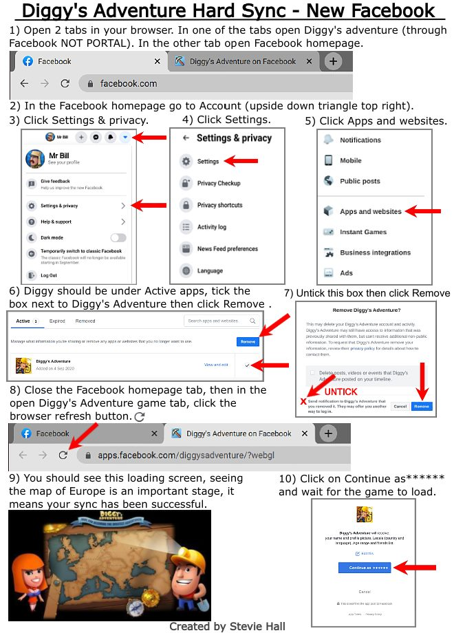

# Hard Sync
Hard Sync is to reset the Facebook setting in the game/reinstall the game on Facebook, which should not and does not 
need to be carried out frequently.
To sync friend list (making the newly added friend to be shown in the game given those friends have the correct 
settings), simply click the friend sync button in the Friends interface 

Hard Sync should be used as the last resort, for example the friend list shows the friends as Player not their name!
[Image](images/shownAsPlayer.jpg).

### Reinstall your game on Facebook, please take these steps 
Please do not worry, reinstalling the game on Facebook will not erase your game progress. But it is always a good 
practice to note down your Player id.

1. Open your Facebook profile, and click on the Settings menu in the upper right corner of your screen. Then select the tab Settings & Privacy: http://prntscr.com/wiz933
2. Continue by clicking again on the Settings tab here: http://prntscr.com/wiz9la
3. Select Apps and Websites section here: http://prntscr.com/wiza2m
4. Mark Diggy's Adventure game in the list, and click on Remove: http://prntscr.com/wizarw
5. Following window will appear, just uncheck the option on the left, and click on Remove: http://prntscr.com/wizb4r
6. You will see the following window, just confirm this by clicking on Done: http://prntscr.com/wizbkf
7. Once you have done all of the steps, please click on this link here: https://apps.facebook.com/diggysadventure
8. This will open the game on Facebook, and install it back again - you will see this screen: http://prntscr.com/wizckr
9. Just click on the "Continue as..." button, and you are good to go :)

