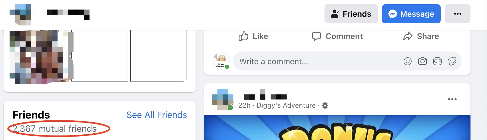
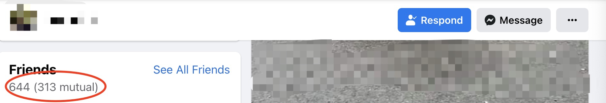
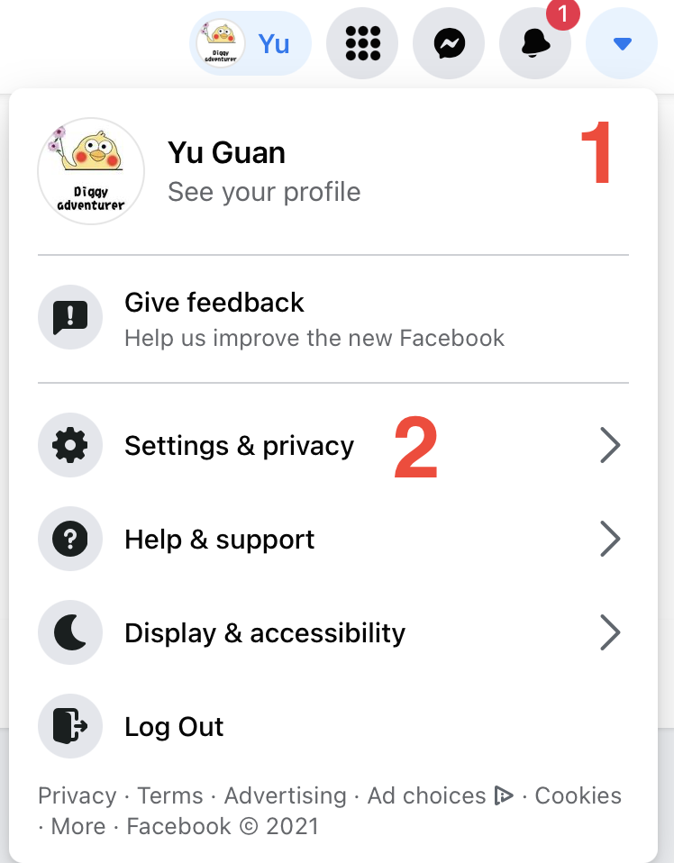
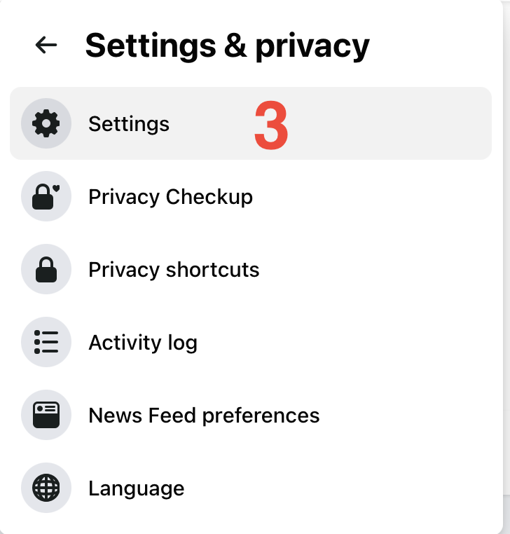
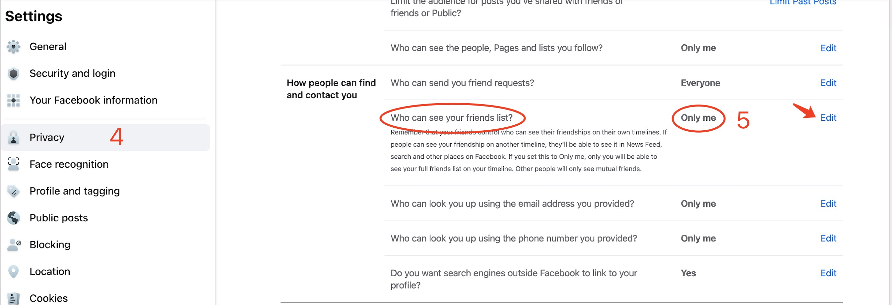

#Secure Friend List
It is very common that in the Facebook group, in the "Add me" poll there is an option for "Secure friend list is a 
must" or similar wording. The 'Secure friend list' means that no one else could see who your friends are except 
mutual friends. The friend with secure friend list would like below which only displays the mutual friends. 
 
The insecure one will display all your friends like below, which means that your friends have the potential risk of 
being contacted by scammers. 

Steps to secure the friend list:
----
1. In the top right corner of Facebook, click the triangle
2. Click Setting & privacy
3. Click Settings 
4. Click Privacy 
5. Under Privacy Settings and Tools, change the setting of ‘Who can see your friends list?’ to 
   ‘Only me’

